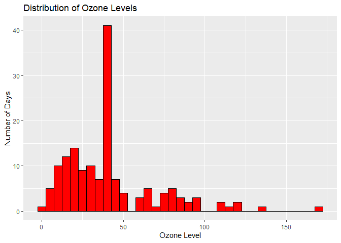

Analyzing Ozone Levels
================
Maria Reccoppa
2023-09-11

## Load Dataset

``` r
data(airquality)
```

## Data Cleaning

``` r
airquality$Ozone[is.na(airquality$Ozone)] <- mean(airquality$Ozone, na.rm = TRUE)
```

## Graphing Distribution of Ozone levels

``` r
ggplot(airquality, aes(Ozone)) +
  geom_histogram(fill = "red", color = "black", binwidth = 5) +
  labs(title = "Distribution of Ozone Levels", x = "Ozone Level", y = "Number of Days")
```

<!-- -->

## Calculating Average Ozone Level By Month

``` r
avg_ozone_by_month <- numeric()
for(month in unique(airquality$Month)){
  avg_ozone_by_month[month] <- mean(airquality$Ozone[airquality$Month == month])
}

avg_ozone_by_month
```

    ## [1]       NA       NA       NA       NA 26.60150 38.32385 56.37570 57.08537
    ## [9] 31.80431
